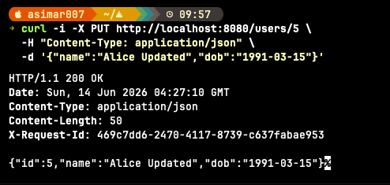
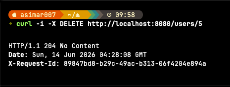
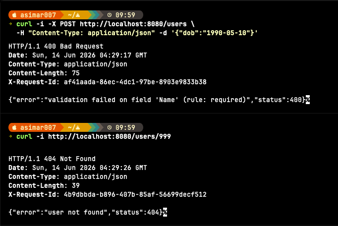

# Screenshots & Demo

Visual walkthrough of the User API running end-to-end. All screenshots were captured against the Docker setup (`docker compose up --build`).

> **How to add your images:** save each screenshot into `docs/img/` using the filenames referenced below, and they'll render automatically here and in the README.

---

## 1. Containers running

`docker compose up --build` builds the app, starts PostgreSQL, runs the migration, and serves the API on port 8080. Look for `connected to database` and `starting server` in the logs.


---

## 2. Create a user — `POST /users`

```bash
curl -i -X POST http://localhost:8080/users \
  -H "Content-Type: application/json" \
  -d '{"name":"Alice","dob":"1990-05-10"}'
```

Returns `201 Created` with the new user (no age field on create).


---

## 3. Get a user — `GET /users/:id` (dynamic age)

```bash
curl http://localhost:8080/users/1
```

The headline feature: `age` is computed live from `dob`, never stored.


---

## 4. List users with pagination — `GET /users`

```bash
curl -i "http://localhost:8080/users?page=1&limit=10"
```

Body is a JSON array; pagination metadata comes back in the `X-Total-Count`, `X-Page`, and `X-Limit` headers. Note the `X-Request-Id` header too.


---

## 5. Update a user — `PUT /users/:id`

```bash
curl -i -X PUT http://localhost:8080/users/1 \
  -H "Content-Type: application/json" \
  -d '{"name":"Alice Updated","dob":"1991-03-15"}'
```

Returns `200 OK` with the updated record.



---

## 6. Delete a user — `DELETE /users/:id`

```bash
curl -i -X DELETE http://localhost:8080/users/2
```

Returns `204 No Content`.



---

## 7. Error handling

Examples of the consistent error envelope:

```bash
# Missing required field → 400
curl -i -X POST http://localhost:8080/users \
  -H "Content-Type: application/json" -d '{"dob":"1990-05-10"}'

# Non-existent user → 404
curl -i http://localhost:8080/users/999
```



